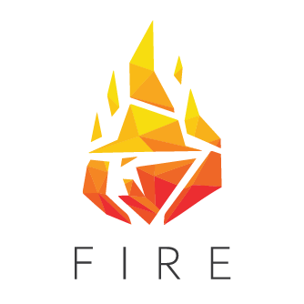
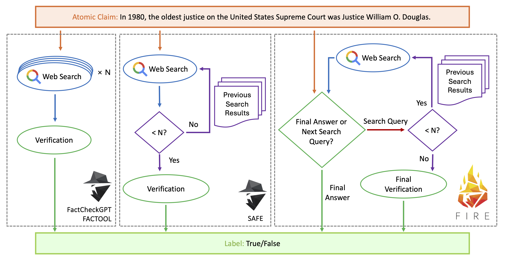
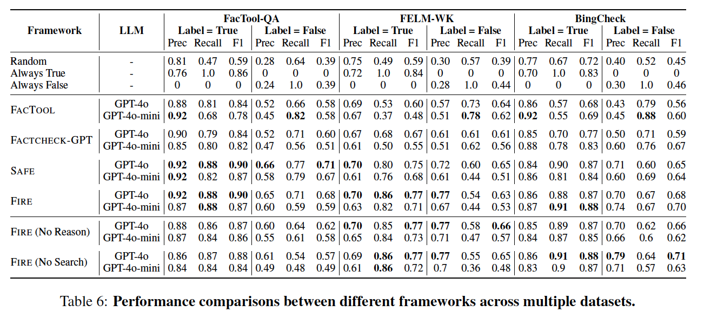
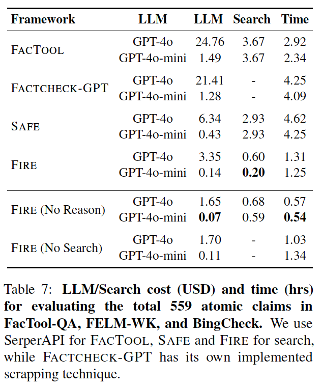

<p align="center">
  
</p>

# 🔥 FIRE: Fact-checking with Iterative Retrieval and Verification

[FIRE](https://github.com/mbzuai-nlp/fire) is a novel agent-based framework for **fact-checking atomic claims**, designed to integrate **evidence retrieval and claim verification** in an **iterative and cost-effective manner**. Unlike traditional systems that fix the number of web queries before verifying, FIRE dynamically decides whether to stop or continue querying based on confidence.

<p align="center">
  
</p>

## 🔍 Why FIRE?

Compared to previous systems like **FACTCHECKGPT**, **FACTOOL**, and **SAFE**, FIRE:
- Integrates reasoning and retrieval instead of separating them
- Dynamically controls the retrieval depth
- Reduces **LLM cost by 7.6×** and **search cost by 16.5×**
- Performs comparably or better on public datasets like FacTool-QA, FELM-WK, BingCheck

## 📌 Features

- **Iterative agent-based reasoning**
- **Unified decision function for retrieval or finalization**
- **Optimized for low-cost verification**
- **Supports both proprietary and open-source LLMs**
- **Extensive evaluations and ablations available**

## 🧠 How It Works

```
Input Claim
   │
   ▼
[FIRE Decision Module]
   ├── confident → Output Label (True / False)
   └── uncertain → Generate Search Query
                      │
                      ▼
          Web Search (via SerperAPI)
                      │
                      ▼
            Update Evidence Set
                      │
                      └── Loop until confident or max steps
```

## 📊 Performance Snapshot

### 🔍 FIRE vs. Baseline Systems

FIRE is compared against state-of-the-art frameworks including **FactCheckGPT**, **FACTOOL**, and **SAFE**.

### 🔧 Performance Across Datasets
<p align="center">
  
</p>

---

### 💰 Cost and Time Efficiency
<p align="center">
  
</p>

## 🚀 Quickstart

```bash
git clone https://github.com/mbzuai-nlp/fire.git
cd fire
pip install -r requirements.txt

# Run FIRE with GPT-4o-mini
python run_fire.py --model gpt-4o-mini --dataset factcheck_bench
```

## 📄 Citation

```bibtex
@inproceedings{xie-etal-2025-fire,
 address = {Albuquerque, New Mexico},
 author = {Xie, Zhuohan  and
Xing, Rui  and
Wang, Yuxia  and
Geng, Jiahui  and
Iqbal, Hasan  and
Sahnan, Dhruv  and
Gurevych, Iryna  and
Nakov, Preslav},
 booktitle = {Findings of the Association for Computational Linguistics: NAACL 2025},
 isbn = {979-8-89176-195-7},
 pages = {2901--2914},
 publisher = {Association for Computational Linguistics},
 title = {{FIRE}: Fact-checking with Iterative Retrieval and Verification},
 url = {https://aclanthology.org/2025.findings-naacl.158/},
 year = {2025}
}
```

## 👥 Authors

Developed by **Zhuohan Xie**, Rui Xing, Yuxia Wang, Jiahui Geng, Hasan Iqbal, Dhruv Sahnan, Iryna Gurevych, and Preslav Nakov  
**Affiliations**: MBZUAI, The University of Melbourne

For questions or collaborations, contact:  
📬 **zhuohan.xie@mbzuai.ac.ae** 

---

_“Fact-checking, now with FIREpower.”_
