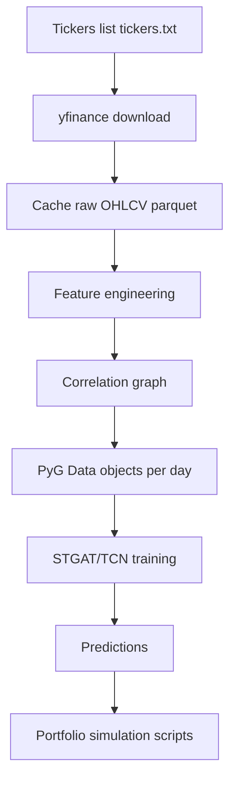

# STGAT (Yahoo Finance Edition)

This package is a **public-data** variant of the original STGAT repository.  
The original code was written to train and evaluate a **Spatial–Temporal Graph Attention Network + Temporal Convolution (STGAT/TCN)** on a proprietary stock dataset (e.g., CSI500 from a financial terminal). This edition swaps the data source to **Yahoo Finance via `yfinance`** so the pipeline can be reproduced with free public data.

> Important note: `yfinance` uses Yahoo Finance endpoints that are not a guaranteed official API. For reproducibility, this repo **caches downloads to disk** and runs off cached data by default.

---

## What the code does (high level)

Given a universe of stock tickers:

1. **Download OHLCV** for all tickers from Yahoo Finance (or load from cache)
2. **Feature engineering** (returns, rolling volatility, momentum, volume change)
3. **Build a static correlation graph** among stocks (top-k neighbors)
4. **Create a dataset of PyTorch Geometric `Data` graphs** (one graph per day)
5. **Train STGAT/TCN** to predict next-day return per stock
6. (Optional) **Run portfolio backtests** using model outputs + helper fields

---

## What changed for Yahoo Finance integration

### Added / replaced modules
- `gen_data_yf_tsd.py`  
  New: builds `torch_geometric.data.Data` objects from Yahoo Finance OHLCV.
- `gen_data_tsd.py`  
  Compatibility wrapper: forwards to `gen_data_yf_tsd.py` so existing imports work.
- `STGAT_tsd.py`  
  Compatibility wrapper: re-exports `GAT_TCN` from `STGAT.py` (the original repo referenced a missing module).

### Key design choices
- **Caching**: downloads are saved to `data_cache/yf_<start>_<end>.parquet`.
- **Targets**: next-day **log return** per ticker (`shouchujia`).
- **Graph**: static correlation graph on returns with top-k neighbors (default k=10).
- **Compatibility fields**: portfolio scripts expect fields such as `gourujia`, `std_dev_next`, `zhangting`, and index-return proxies. These are provided.

---

## Flow chart



---

## Install (macOS friendly)

Create and activate a virtual environment:

```bash
python -m venv .venv
source .venv/bin/activate
```

Install dependencies:

```bash
pip install -U pip
pip install numpy pandas matplotlib scikit-learn yfinance pyarrow
pip install torch torchvision torchaudio
pip install torch_geometric
```

> `torch_geometric` installation can vary by platform. If install fails, follow the official installation instructions for your PyTorch version:
> https://pytorch-geometric.readthedocs.io/

---

## Quickstart

1) Create `tickers.txt` (one ticker per line):

```text
AAPL
MSFT
AMZN
GOOGL
META
NVDA
TSLA
JPM
XOM
UNH
```

2) (Optional) Pre-download and cache raw OHLCV:

```bash
python scripts/fetch_yf.py --tickers tickers.txt --start 2018-01-01 --end 2024-12-31
```

3) Train:

```bash
python STGAT_train.py
```

---

## Running portfolio scripts

These scripts require a trained checkpoint. By default they look for the original filenames; you can override with `--checkpoint`.

Example:

```bash
python Generate_portfolio_SP500.py --tickers_file tickers.txt --start 2018-01-01 --end 2024-12-31 --checkpoint best_model.pt
```

If the checkpoint is missing, the script will raise a clear error and tell you to train first.

---

## Reproducibility notes

- Random seeds are set in `gen_data_yf_tsd.py` via `YFConfig(seed=...)`.
- The pipeline caches raw data to reduce variability from changing Yahoo responses.
- Web-sourced data may have survivorship bias and ticker availability issues.

---

## Limitations

- Yahoo Finance endpoints can throttle large downloads. Keep the ticker universe modest during development and use caching.
- Some tickers may not resolve. The simplest workaround is to remove them from `tickers.txt`.
- The original repo used CSI500 and other non-US market conventions (e.g., limit-up `zhangting`). This edition fills `zhangting` with zeros for compatibility.

---

## File list (key)

- `STGAT.py` : STGAT/TCN model (patched to output `num_nodes` predictions)
- `STGAT_tsd.py` : wrapper export for `GAT_TCN`
- `gen_data_yf_tsd.py` : Yahoo Finance data -> PyG Data objects
- `gen_data_tsd.py` : compatibility wrapper
- `STGAT_train.py` : training loop (patched for dynamic `num_nodes`)
- `Generate_portfolio_S&P500.py` : portfolio script (patched for yfinance + CLI args)
- `Generate_portfolio_CSI500.py` : portfolio script (patched for yfinance + CLI args)
- `scripts/fetch_yf.py` : downloader to build cache


## Troubleshooting: yfinance `OperationalError('database is locked')`

If you see a message like:

- `Failed download: ... OperationalError('database is locked')`

it is typically caused by yfinance's internal caching interacting with threaded downloads.
This repo disables threading for downloads and retries failed tickers one-by-one in `scripts/fetch_yf.py`.
If it still happens, close other Python processes using yfinance, restart your kernel/terminal session, and rerun the fetch.


## Python version note

This project is tested most reliably on **Python 3.11 or 3.12**. Using bleeding-edge or pre-release Python versions (e.g., 3.13/3.14) can cause incompatibilities with PyTorch / PyTorch Geometric.
